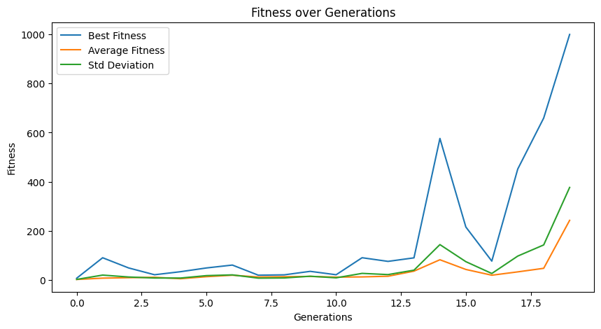

# Flappy Bird AI
This project uses the NEAT (NeuroEvolution of Augmenting Topologies) algorithm to train an AI agent to play Flappy Bird. The project includes configuration files, assets, and state files necessary for running and training the AI.

## Overview
NEAT is an evolutionary algorithm that evolves neural networks. In this project, NEAT is used to train a neural network to control the Flappy Bird game, making the bird flap to navigate through pipes without hitting them.

## Demo Video
Watch the AI in action:

## Libraries Used
The following libraries are used in this project:
- [Pygame](https://www.pygame.org/) - For creating the game window and handling game graphics and events.
- [NEAT-Python](https://neat-python.readthedocs.io/en/latest/) - For implementing the NEAT algorithm.
- [Matplotlib](https://matplotlib.org/) - For plotting training progress and fitness graphs.

## Fitness Progress Plot
The following plot shows the fitness progress over generations, highlighting both the best and average fitness values achieved during training.

## Contributors

-  [Siddharth Dhaigude](https://www.linkedin.com/in/sdhaigude/) 
   
   